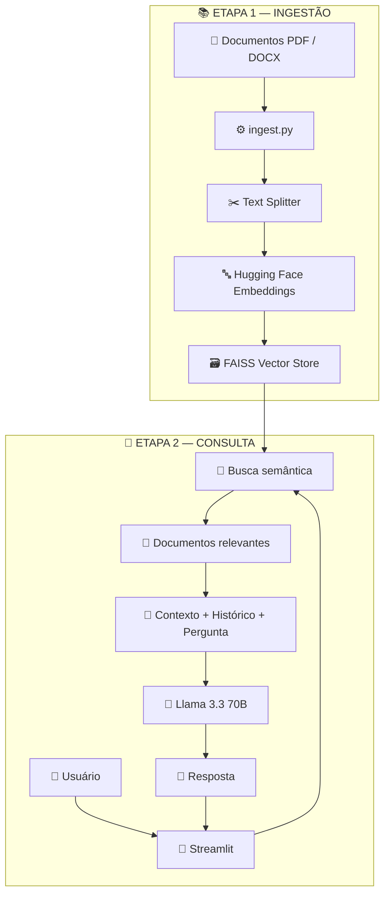
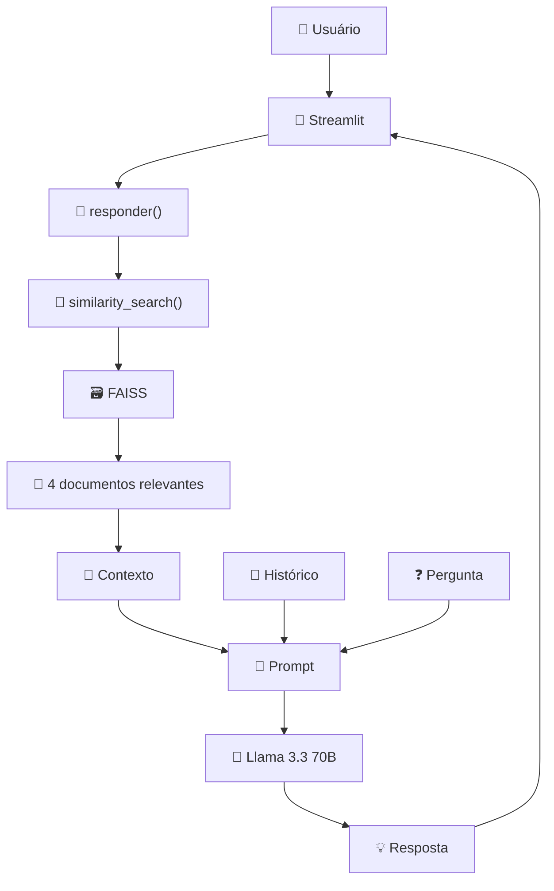
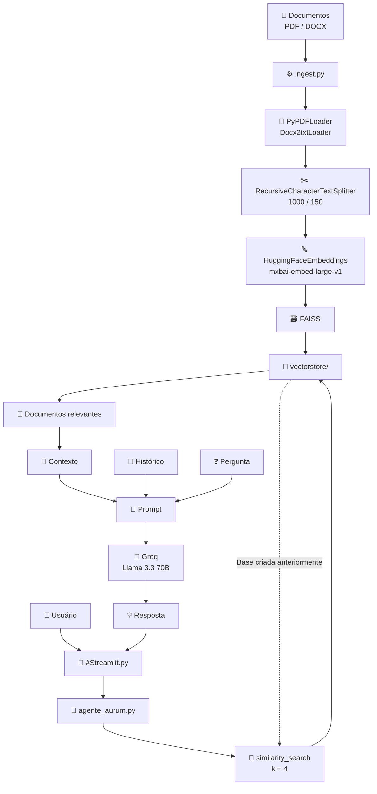

# 🏛️ Aurum — Assistente Virtual

> Assistente virtual baseado em Inteligência Artificial e arquitetura RAG para responder dúvidas utilizando informações presentes na documentação interna do Banco Aurum Digital.

---

## 📌 Sobre o projeto

O **Aurum Assistente Virtual** é uma aplicação de Inteligência Artificial desenvolvida para auxiliar colaboradores do **Banco Aurum Digital** na consulta de informações presentes na documentação interna da empresa.

A aplicação utiliza uma arquitetura baseada em **RAG (Retrieval-Augmented Generation)**. Antes de gerar uma resposta, o sistema realiza uma busca semântica na base vetorial para encontrar os trechos mais relevantes da documentação.

Esses trechos são então enviados ao modelo de linguagem como contexto para a geração da resposta.

O projeto é dividido em três etapas principais:

1. 📚 **Ingestão da documentação**
2. 🔎 **Recuperação de informações**
3. 🤖 **Geração da resposta**

A interface conversacional é disponibilizada através do **Streamlit**.

---

# 🎯 Objetivo

O objetivo do projeto é permitir que colaboradores façam perguntas em linguagem natural sobre procedimentos, políticas, manuais e demais informações presentes na documentação interna.

O assistente foi configurado para:

* utilizar exclusivamente as informações recuperadas da documentação;
* não inventar informações;
* responder de forma profissional e objetiva;
* informar quando determinada informação não estiver disponível;
* limitar suas respostas ao contexto do Banco Aurum Digital.

---

# 🏗️ Arquitetura geral

O funcionamento completo do projeto pode ser dividido em duas grandes etapas:



---

# 🔄 Como o processo funciona

## 1. 📚 Ingestão dos documentos

Os documentos são colocados na pasta configurada para a documentação.

Atualmente, o projeto possui suporte para:

| Formato | Loader           |
| ------- | ---------------- |
| `.pdf`  | `PyPDFLoader`    |
| `.docx` | `Docx2txtLoader` |

O `ingest.py` percorre os arquivos existentes na pasta de documentos, identifica sua extensão e seleciona automaticamente o loader correspondente.

Arquivos com formatos não suportados são ignorados.

---

## 2. 📄 Carregamento

Cada documento é carregado utilizando o loader correspondente.

Durante esse processo, o sistema adiciona aos documentos um metadado chamado `origem`, contendo o nome do arquivo de origem.

Isso permite identificar posteriormente de qual documento determinado conteúdo foi obtido.

---

## 3. ✂️ Divisão dos documentos

Depois do carregamento, os documentos são divididos em partes menores, chamadas de **chunks**.

O projeto utiliza:

```text
chunk_size = 1000
chunk_overlap = 150
```

Isso significa que cada trecho possui aproximadamente 1000 caracteres e existe uma sobreposição de 150 caracteres entre trechos consecutivos.

A divisão é realizada utilizando:

```text
RecursiveCharacterTextSplitter
```

---

## 4. 🔤 Geração dos embeddings

Depois da divisão, cada chunk é convertido em uma representação vetorial utilizando o modelo:

```text
mixedbread-ai/mxbai-embed-large-v1
```

O modelo é carregado através da integração do LangChain com Hugging Face.

---

## 5. 🗃️ Criação do FAISS

Os embeddings são armazenados em um **FAISS Vector Store**.

O resultado é salvo localmente na pasta:

```text
vectorstore/
```

O `ingest.py` informa ao final quantos chunks foram processados e onde o vectorstore foi salvo.

---

# 🔎 Processo de consulta

Quando o usuário faz uma pergunta, o fluxo é:



A função `responder()` realiza uma busca por similaridade no FAISS e atualmente recupera **4 documentos** para compor o contexto da resposta.

---

# 🧠 Arquitetura RAG

O projeto utiliza **Retrieval-Augmented Generation (RAG)**.

A ideia pode ser resumida em:

```text
Pergunta
   ↓
Busca na base vetorial
   ↓
Documentos relevantes
   ↓
Contexto
   ↓
LLM
   ↓
Resposta
```

Dessa maneira, o modelo recebe informações recuperadas da documentação antes de produzir a resposta.

---

# 📁 Estrutura do projeto

A estrutura recomendada para o repositório é:

```text
aurum-assistente/
│
├── #Streamlit.py
├── agente_aurum.py
├── ingest.py
│
├── files/
│   ├── documento_01.pdf
│   ├── documento_02.pdf
│   └── documento_03.docx
│
├── vectorstore/
│   └── ...
│
├── .env
├── .gitignore
├── requirements.txt
└── README.md
```

### Descrição dos principais arquivos

| Arquivo / Pasta    | Responsabilidade                                  |
| ------------------ | ------------------------------------------------- |
| `#Streamlit.py`    | Interface gráfica e chat                          |
| `agente_aurum.py`  | Lógica do agente e geração das respostas          |
| `ingest.py`        | Processamento e indexação dos documentos          |
| `files/`           | Documentação utilizada como fonte de conhecimento |
| `vectorstore/`     | Base vetorial FAISS gerada pela ingestão          |
| `.env`             | Variáveis de ambiente e credenciais               |
| `requirements.txt` | Dependências Python                               |
| `README.md`        | Documentação do projeto                           |

---

# 🧩 Componentes do sistema

## `#Streamlit.py`

É responsável pela interface da aplicação.

Entre suas funções estão:

* configuração da página;
* estilização da interface;
* criação da sidebar;
* controle da sessão;
* armazenamento das mensagens;
* campo para envio de perguntas;
* exibição das respostas;
* comunicação com o agente.

Quando o usuário envia uma pergunta, a interface chama:

```python
responder(pergunta, session_id=st.session_state.session_id)
```

A resposta retornada pelo agente é então exibida no chat.

---

# 🤖 `agente_aurum.py`

É o componente responsável pela inteligência do sistema.

Ele realiza:

1. carregamento do LLM;
2. carregamento dos embeddings;
3. carregamento do FAISS;
4. busca semântica;
5. montagem do contexto;
6. inclusão do histórico;
7. construção do prompt;
8. chamada do modelo;
9. armazenamento do histórico;
10. retorno da resposta.

---

## 🧠 Modelo de linguagem

O projeto utiliza o modelo:

```text
llama-3.3-70b-versatile
```

através do serviço da **Groq**.

A temperatura está configurada como:

```text
temperature = 0
```

A configuração do modelo está presente na função `load_llm()`.

---

## 🔤 Modelo de embeddings

Para representar os documentos e perguntas em formato vetorial, o projeto utiliza:

```text
mixedbread-ai/mxbai-embed-large-v1
```

Esse modelo é utilizado tanto durante a criação do FAISS quanto no carregamento da base vetorial para consultas.

---

# ⚙️ `ingest.py`

O `ingest.py` é responsável por transformar a documentação em uma base vetorial consultável.

Seu processo é:

```text
📄 PDF / DOCX
      ↓
📖 Loader
      ↓
📄 Documentos carregados
      ↓
✂️ Chunking
      ↓
🔤 Embeddings
      ↓
🗃️ FAISS
      ↓
📁 vectorstore/
```

### Loaders utilizados

```python
LOADERS = {
    ".pdf": PyPDFLoader,
    ".docx": Docx2txtLoader,
}
```

Arquivos com outras extensões são ignorados pelo processo de ingestão.

---

# 📏 Configuração dos chunks

O projeto utiliza:

```python
RecursiveCharacterTextSplitter(
    chunk_size=1000,
    chunk_overlap=150
)
```

### Configurações

| Configuração     | Valor |
| ---------------- | ----: |
| Tamanho do chunk |  1000 |
| Sobreposição     |   150 |

A sobreposição ajuda a manter parte do contexto entre chunks consecutivos.

---

# 🗃️ FAISS Vector Store

Após a criação dos embeddings, os documentos são transformados em um índice FAISS.

O índice é salvo localmente:

```text
vectorstore/
```

Durante a inicialização do agente, o FAISS é carregado dessa pasta.

Caso o vectorstore não exista, o agente informa que é necessário executar o processo de ingestão primeiro.

---

# 🚀 Instalação

## Pré-requisitos

Antes de executar o projeto, tenha instalado:

* Python 3.x
* pip
* Git

Também é necessária uma chave de API da Groq para utilização do modelo de linguagem.

---

## 1. Clone o repositório

```bash
git clone https://github.com/SEU-USUARIO/aurum-assistente.git
```

Entre na pasta:

```bash
cd aurum-assistente
```

---

# 2. Crie um ambiente virtual

### Windows

```bash
python -m venv venv
```

Ative:

```bash
venv\Scripts\activate
```

### Linux / macOS

```bash
python3 -m venv venv
```

Ative:

```bash
source venv/bin/activate
```

---

# 3. Instale as dependências

```bash
pip install -r requirements.txt
```

---

# 4. Configure as variáveis de ambiente

Crie um arquivo:

```text
.env
```

Na raiz do projeto.

Adicione sua chave da Groq, ou da llm de sua escolha. Apenas será necessário mudar o modelo no código:

```env
GROQ_API_KEY=sua_chave_aqui
```
---

# 5. Adicione os documentos

Coloque os documentos que serão utilizados como fonte de conhecimento dentro da pasta:

```text
files/
```

Atualmente são suportados:

```text
.pdf
.docx
```

---

# 6. Gere o Vector Store

Execute:

```bash
python ingest.py
```

O processo irá:

1. encontrar os documentos;
2. carregar PDFs e DOCX;
3. adicionar metadados de origem;
4. dividir os documentos em chunks;
5. gerar embeddings;
6. criar o FAISS;
7. salvar o vectorstore.

Ao final, será criada a pasta:

```text
vectorstore/
```

---

# 7. Execute a aplicação

Depois de criar o vectorstore:

```bash
streamlit run "#Streamlit.py"
```

O Streamlit disponibilizará a aplicação para acesso pelo navegador.

---

# 💬 Utilização

Após iniciar a aplicação, o usuário verá uma interface de chat.

A interface mantém as mensagens da sessão e disponibiliza também uma opção para limpar a conversa.

# 📝 Construção do prompt

O prompt enviado ao LLM é composto por três elementos principais:

```text
┌─────────────────────┐
│ 🧾 Histórico        │
├─────────────────────┤
│ 📚 Documentação     │
├─────────────────────┤
│ ❓ Pergunta         │
└──────────┬──────────┘
           ↓
      📝 PROMPT
           ↓
       🧠 LLM
---

# 🛡️ Regras do assistente

O agente possui regras específicas para controlar o comportamento das respostas.

Entre elas:

### 1. Utilizar somente o contexto

O modelo deve utilizar apenas as informações recuperadas da documentação.

### 2. Não inventar informações

O assistente não deve complementar a resposta utilizando conhecimento externo.

### 3. Linguagem profissional

As respostas devem ser claras, objetivas, profissionais e cordiais.

### 4. Referência às políticas internas

Quando apropriado, o assistente deve indicar que a informação está baseada em uma política, procedimento ou diretriz interna.

### 5. Informações ausentes

Quando uma informação não estiver disponível na documentação, o sistema deve informar:

```text
Não encontrei essa informação na documentação da empresa.
```

### 6. Perguntas fora do escopo

Para perguntas que não estejam relacionadas à documentação interna, o agente deve informar:

```text
Posso ajudar apenas com informações presentes na documentação interna do Banco Aurum Digital.
```

---

# 🔄 Mapa visual completo



---

# 🧭 Fluxo resumido

```text
                    ┌──────────────────┐
                    │  📚 DOCUMENTOS   │
                    │    PDF / DOCX    │
                    └────────┬─────────┘
                             │
                             ▼
                    ┌──────────────────┐
                    │    ingest.py     │
                    └────────┬─────────┘
                             │
                             ▼
                    ┌──────────────────┐
                    │ ✂️ Chunks        │
                    │ 1000 / 150       │
                    └────────┬─────────┘
                             │
                             ▼
                    ┌──────────────────┐
                    │ 🔤 Embeddings    │
                    │ mxbai-embed      │
                    └────────┬─────────┘
                             │
                             ▼
                    ┌──────────────────┐
                    │ 🗃️ FAISS        │
                    │ vectorstore/     │
                    └────────┬─────────┘
                             │
                             │
              ───────────────┼───────────────
                             │
                             ▼
                    ┌──────────────────┐
                    │   👤 USUÁRIO     │
                    └────────┬─────────┘
                             │
                             ▼
                    ┌──────────────────┐
                    │ 💬 STREAMLIT     │
                    └────────┬─────────┘
                             │
                             ▼
                    ┌──────────────────┐
                    │ 🤖 AGENTE        │
                    └────────┬─────────┘
                             │
                             ▼
                    ┌──────────────────┐
                    │ 🔎 BUSCA FAISS   │
                    │      k = 4       │
                    └────────┬─────────┘
                             │
                             ▼
                    ┌──────────────────┐
                    │ 📝 CONTEXTO      │
                    │ + HISTÓRICO      │
                    │ + PERGUNTA       │
                    └────────┬─────────┘
                             │
                             ▼
                    ┌──────────────────┐
                    │ 🧠 LLAMA 3.3     │
                    │      70B         │
                    └────────┬─────────┘
                             │
                             ▼
                    ┌──────────────────┐
                    │ 💡 RESPOSTA      │
                    └────────┬─────────┘
                             │
                             ▼
                    ┌──────────────────┐
                    │ 💬 STREAMLIT     │
                    └──────────────────┘
```

---

# 🛠️ Tecnologias

| Tecnologia                        | Função no projeto                      |
| --------------------------------- | -------------------------------------- |
| 🐍 Python                         | Linguagem principal                    |
| 🎈 Streamlit                      | Interface web                          |
| 🦜 LangChain                      | Orquestração dos componentes de IA     |
| ⚡ Groq                           | Execução/acesso ao modelo de linguagem |
| 🧠 Llama 3.3 70B                  | Geração das respostas                  |
| 🤗 Hugging Face                   | Modelo de embeddings                   |
| 🔤 mxbai-embed-large-v1           | Transformação de texto em vetores      |
| 🗃️ FAISS                          | Armazenamento e busca vetorial         |
| 📄 PyPDFLoader                    | Leitura de PDF                         |
| 📄 Docx2txtLoader                 | Leitura de DOCX                        |
| ✂️ RecursiveCharacterTextSplitter | Divisão dos documentos                 |
| 🔐 python-dotenv                  | Carregamento de variáveis de ambiente  |
| 🆔 UUID                           | Identificação das sessões              |

---

# 📦 Dependências

As principais dependências do projeto são:

```text
streamlit
python-dotenv
langchain-groq
langchain-huggingface
langchain-community
langchain-text-splitters
faiss
---

# 🔐 Segurança e publicação no GitHub

Antes de publicar o projeto, verifique cuidadosamente os arquivos que serão enviados.

## ⚠️ Não publique:

```text
.env
```

nem chaves de API, senhas ou tokens.

Também é importante avaliar se a pasta:

```text
files/
```

contém documentação interna ou confidencial.

Como o objetivo do projeto é trabalhar com documentação interna do Banco Aurum Digital, **não é recomendado publicar documentos corporativos confidenciais em um repositório público**.

O mesmo cuidado deve ser aplicado à pasta:

```text
vectorstore/
```

porque ela representa uma base derivada dos documentos utilizados pelo sistema.

---

# 🚨 Configuração importante do `ingest.py`

Atualmente o código possui um caminho absoluto para a pasta de documentos:

```python
PASTA_DOCUMENTOS = r"C:\Users\Lenovo\Desktop\python\Tech Ai project\files"
```

Esse caminho funciona apenas no computador em que essa estrutura existe.

Para publicar o projeto no GitHub, recomenda-se alterar para uma configuração relativa.

Por exemplo:

```python
PASTA_DOCUMENTOS = "files"
```

Assim, o projeto pode ser executado em diferentes computadores sem depender do caminho pessoal do desenvolvedor.

---

# 📈 Melhorias futuras

Possíveis evoluções do projeto:

* [ ] Tornar o caminho dos documentos configurável
* [ ] Criar `requirements.txt` com versões fixadas
* [ ] Criar testes automatizados
* [ ] Adicionar validação dos documentos
* [ ] Melhorar tratamento de erros
* [ ] Adicionar logs
* [ ] Adicionar autenticação
* [ ] Persistir histórico de usuários
* [ ] Adicionar avaliação da qualidade das respostas
* [ ] Adicionar fontes/referências aos documentos recuperados
* [ ] Criar interface para atualização da base documental
* [ ] Automatizar a ingestão de novos documentos
* [ ] Containerizar a aplicação com Docker
* [ ] Criar pipeline de CI/CD

---

# 🧪 Status do projeto

**Status:** 🚧 Em processo de melhorias

A aplicação já possui:

* [x] Interface de chat
* [x] LLM integrado
* [x] Embeddings
* [x] FAISS
* [x] Ingestão de PDF
* [x] Ingestão de DOCX
* [x] Chunking dos documentos
* [x] Busca semântica
* [x] Histórico de conversa
* [x] Regras de comportamento do agente
* [x] Deploy

---

# 👨‍💻 Aurum Assistente Virtual

Projeto desenvolvido como teste para o programa ONE, utilizando Inteligência Artificial e busca semântica para facilitar o acesso dos colaboradores às informações presentes na documentação interna.

```text
🏛️ AURUM
Assistente Virtual
```

---
