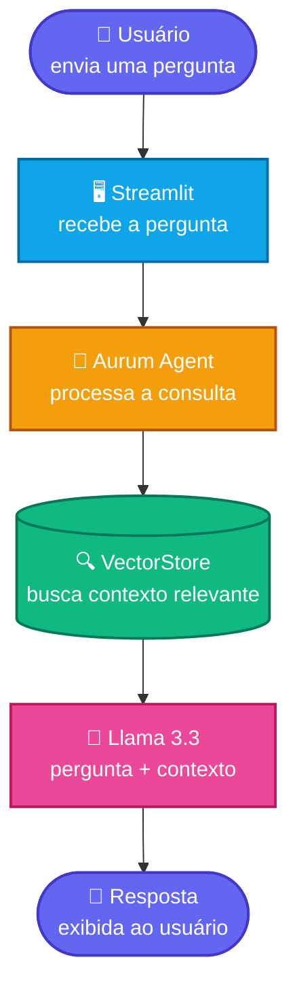

# 🏦 Aurum Bank Assistant

O **Aurum Bank Assistant** é um assistente virtual desenvolvido para auxiliar funcionários de um banco digital, respondendo dúvidas de forma rápida e contextualizada a partir de uma base de conhecimento própria.

## 🚀 Demonstração

**Acesse o aplicativo:**
[🔗 Aurum Bank Assistant](https://aurum-bank-assistant-eepcopvxw2cj4nu55agmqk.streamlit.app/)

## 💡 Sobre o aplicativo

O Aurum Bank Assistant funciona como um atendente virtual capaz de interpretar perguntas dos usuários e consultar uma base de conhecimento antes de gerar uma resposta.

A aplicação utiliza **RAG (Retrieval-Augmented Generation)** para combinar a recuperação de informações relevantes com um modelo de linguagem, permitindo que as respostas sejam baseadas nos conteúdos disponíveis sobre o banco.

### ✨ Principais funcionalidades

* 💬 Conversação em linguagem natural
* 🔎 Busca semântica na base de conhecimento
* 🤖 Geração de respostas utilizando Llama 3.3
* 🏦 Respostas baseadas nos documentos do Aurum Bank
* ⚡ Interface interativa desenvolvida com Streamlit

## ⚙️ Como executar o projeto localmente

[#️-como-executar-o-projeto](#️-como-executar-o-projeto)

### 1. Clone o repositório

```bash
git clone https://github.com/dasilvarafaelf-rgb/Aurum-Bank-Assistant.git
cd Aurum-Bank-Assistant
```

### 2. Crie um ambiente virtual (opcional, mas recomendado)

```bash
python -m venv venv
venv\Scripts\activate      # Windows
source venv/bin/activate   # Linux/Mac
```

### 3. Instale as dependências

```bash
pip install -r requirements.txt
```

### 4. Configure sua chave de API

Crie um arquivo `.env` na raiz do projeto com sua chave da Groq:

GROQ_API_KEY= "sua_chave_aqui"

### 5. Gere a base vetorial

Antes de rodar o assistente pela primeira vez (ou sempre que os documentos em `files/` forem atualizados), execute:

```bash
python ingest.py
```

Isso lê os documentos da pasta `files/`, gera os embeddings e salva a base vetorial em `vectorstore/`.

### 6. Inicie a aplicação

```bash
streamlit run "#Streamlit.py"
```

A aplicação abrirá automaticamente no navegador, geralmente em `http://localhost:8501`.

## 💬 Exemplos de perguntas que o agente consegue responder

[#-exemplos-de-perguntas-que-o-agente-consegue-responder](#-exemplos-de-perguntas-que-o-agente-consegue-responder)

O Aurum Bank Assistant responde a perguntas relacionadas às políticas e procedimentos internos do banco, cobrindo áreas como RH, Compliance, TI, Comercial, Financeiro e normas institucionais. Alguns exemplos:

- "Quais são as políticas de home office da empresa?"
- "Como funciona o processo de aprovação de crédito?"
- "Quais são as normas de segurança da informação da TI?"
- "Qual o procedimento em caso de suspeita de fraude?"
- "Quais benefícios os colaboradores têm direito?"

## 📋 Exemplos de respostas geradas pelo agente

[#-exemplos-de-respostas-geradas-pelo-agente](#-exemplos-de-respostas-geradas-pelo-agente)

**Pergunta:** "                           

Quais são as políticas de home office da empresa?


**Resposta:**
>Prezado colaborador,
>
>Agradeço sua pergunta sobre as políticas de home office da empresa. De acordo com as diretrizes da empresa, os colaboradores em modelo >híbrido ou remoto têm direito a auxílio home office, pago mensalmente via folha.
>
>Além disso, conforme a política de Recursos Humanos, o modelo híbrido padrão da empresa estabelece um mínimo de 2 dias presenciais por >semana para áreas administrativas, definidos por cada diretoria. A jornada de trabalho é de 40 horas semanais, com banco de horas para >compensação de eventuais extrapolações.
>
>É importante notar que áreas de atendimento e operações críticas seguem escalas específicas, publicadas com no mínimo 15 dias de >antecedência.
>
>Se tiver mais alguma dúvida relacionada às políticas ou procedimentos internos, estou à disposição para ajudar.
>
> Atenciosamente,
> Aurum Bank Assistant

> 💡 As respostas são geradas exclusivamente com base nos documentos internos carregados na base de conhecimento — quando a informação não está disponível, o assistente informa isso claramente em vez de inventar uma resposta.

**Pergunta:** "

Como funciona o processo de aprovação de crédito?

**Resposta:**

> Prezado colaborador,
>
>Agradeço sua pergunta sobre o processo de aprovação de crédito no Banco Aurum Digital. De acordo com as diretrizes da empresa, o >processo de aprovação de crédito envolve várias etapas para garantir que as decisões sejam tomadas de forma responsável e transparente.
>
>Conforme a política de crédito da empresa, o processo começa com a avaliação da capacidade de pagamento do cliente, seguida pela >análise de crédito e, por fim, a aprovação ou não do crédito. É importante notar que a empresa segue um modelo analítico de crédito e >risco que utiliza machine learning para tomar decisões de crédito, mas essas decisões sempre passam por validação humana responsável.
>
>Além disso, a empresa tem como política evitar incentivos a vendas inadequadas, garantindo que as metas de volume nunca representem >mais de 60% do peso total da avaliação. Isso ajuda a assegurar que os colaboradores não sejam incentivados a vender produtos de >crédito sem considerar a capacidade de pagamento do cliente.
>
>Com base na política interna, é vedada qualquer meta ou bonificação individual vinculada à venda de produtos de crédito sem análise de >capacidade de pagamento do cliente. Essa abordagem reforça o compromisso da empresa em promover práticas responsáveis de crédito e >proteger os interesses dos clientes.
>
>Se tiver mais alguma dúvida relacionada às políticas ou procedimentos internos, estou à disposição para ajudar.
>
>Atenciosamente,

## 🧠 Fluxo da aplicação

O funcionamento do Aurum Bank Assistant pode ser dividido em duas etapas principais: **construção da base de conhecimento** e **processamento das perguntas do usuário**.

### 1. 📚 Construção da base de conhecimento

Antes das perguntas chegarem ao assistente, os documentos disponibilizados pelo banco são processados pelo `ingest.py`.

O fluxo acontece da seguinte maneira:

```text
Documentos do banco
        ↓
Leitura dos arquivos
        ↓
Divisão dos documentos em trechos
        ↓
Geração dos embeddings
        ↓
Armazenamento no FAISS
        ↓
VectorStore
```

Os documentos são transformados em pequenos trechos para facilitar a recuperação das informações. Cada trecho recebe uma representação vetorial (*embedding*), permitindo que o sistema encontre conteúdos semanticamente relacionados a uma pergunta.

Esses vetores são armazenados no **FAISS**, formando o `vectorstore` utilizado pelo assistente.

### 2. 💬 Processamento da pergunta

Quando o usuário envia uma pergunta pelo Streamlit, ela passa pelo fluxo principal do `agente_aurum.py`.

```text
Usuário
   ↓
Interface Streamlit
   ↓
Pergunta enviada ao agente
   ↓
Busca no VectorStore
   ↓
Trechos relevantes recuperados
   ↓
Contexto + pergunta
   ↓
Llama 3.3 via Groq
   ↓
Resposta gerada
   ↓
Exibição no Streamlit
```

Primeiramente, a pergunta é recebida pelo aplicativo e encaminhada para o agente.

O agente utiliza o **VectorStore** para realizar uma busca semântica e recuperar os trechos da base de conhecimento que possuem maior relação com a pergunta.

Esses conteúdos recuperados são então utilizados como **contexto** para o modelo de linguagem.

A pergunta do usuário e o contexto encontrado são enviados ao **Llama 3.3**, executado através da API da **Groq**. O modelo utiliza essas informações para elaborar a resposta final.

Por fim, a resposta retorna para o Streamlit e é apresentada ao usuário na interface de conversa.

### 🔄 Resumindo o fluxo



Dessa forma, o modelo não depende apenas do conhecimento geral que possui. Ele recebe informações recuperadas especificamente da base do Aurum Bank, tornando o processo mais direcionado ao contexto da aplicação.

## 🛠️ Tecnologias

* **Python** — desenvolvimento da aplicação
* **Streamlit** — interface web
* **LangChain** — integração e gerenciamento do fluxo de IA
* **Groq** — execução do modelo de linguagem
* **Llama 3.3** — modelo utilizado para geração das respostas
* **Hugging Face** — geração dos embeddings
* **FAISS** — armazenamento e busca vetorial

## 📂 Estrutura do projeto

```text
Aurum-Bank-Assistant/
├── files/                  # Base de documentos do banco
├── vectorstore/            # Base vetorial
├── agente_aurum.py        # Lógica do assistente
├── ingest.py              # Processamento dos documentos
├── #Streamlit.py          # Interface da aplicação
├── requirements.txt       # Dependências
└── .gitignore
```

## 🎯 Objetivo

O projeto foi desenvolvido como uma aplicação prática de **Inteligência Artificial Generativa**, explorando RAG, embeddings, busca vetorial e integração com modelos de linguagem.

A proposta é demonstrar como essas tecnologias podem ser combinadas para criar um assistente especializado, capaz de consultar uma base de conhecimento específica e transformar as informações encontradas em respostas naturais para o usuário.

## 👨‍💻 Autor

**Rafael da Silva**

[GitHub](https://github.com/dasilvarafaelf-rgb)

